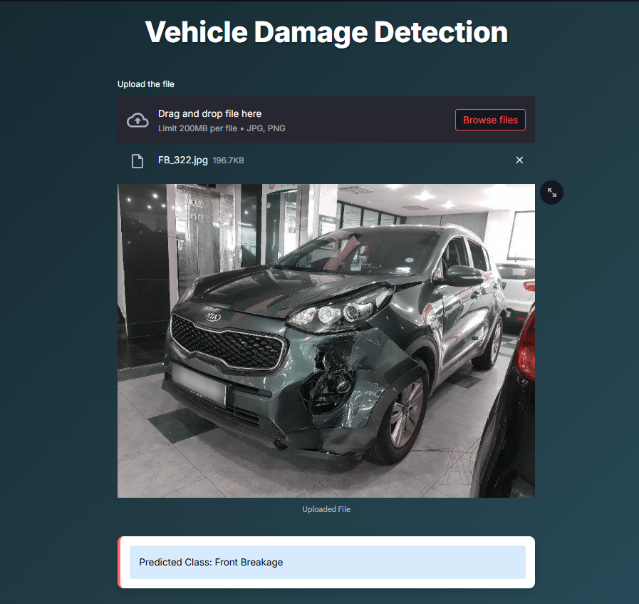

# 🚗 Vehicle Damage Detection App

## 📋 Overview
This app lets you drag and drop an image of a car and it will tell you what kind of damage it has.
The model is trained on third-quarter front and rear views - please capture the third-quarter front or rear view of a car.



## 🧠 Model Details
- **Architecture**: ResNet50 with transfer learning
- **Training Data**: ~1700 images
- **Target Classes**: 6 categories
  - Front Normal ✅
  - Front Crushed 💥
  - Front Breakage 🔧
  - Rear Normal ✅
  - Rear Crushed 💥
  - Rear Breakage 🔧
- **Validation Accuracy**: ~80%

### 🛠️ Setup

1. To get started, first install the dependencies using:
    ```commandline
     pip install -r requirements.txt
    ```
   
2. Run the streamlit app:
   ```commandline
   streamlit run app.py
 
## 👨‍💻 Author

Yoseph Negash

📅 2026


  
